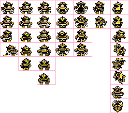

---

[ [English](https://github.com/y-tetsu/sprite_viewer/blob/main/README.md) | [日本語](https://github.com/y-tetsu/sprite_viewer/blob/main/README.jp.md)]<br>

# 🎮 Sprite Viewer

スプライトシート（PNG）とアニメーション定義（JSON）を読み込み、  
アニメーションの動作確認ができる Pygame 製の簡易ツールです。  
レトロ風2Dゲーム制作時のチェック用に便利です。



---

## 📦 主な機能

- `.png` + `.json` のスプライトとメタデータ読み込み
- 水平・垂直反転表示
- フレームレート変更
- ループON/OFF切替
- 一時停止／再生の切替
- フレーム単位での再生制御
- 表示倍率（スケール）の変更
- 最小限のUIと便利なアニメーション情報付き
- スプライトサイズに合わせた自動ウィンドウ調整
- コマンドラインで初期設定可能
- 現在のアニメーションをGIFとして書き出し

---

## 🖼️ JSONファイル例

```json
{
  "image_path": "sample.png",
  "frame_width": 16,
  "frame_height": 16,
  "border": 1,
  "animations": [
    {
      "name": "walk",
      "frames": [0, 1, 2, 3],
      "fps": 8,
      "loop": true
    },
    {
      "name": "jump",
      "frames": [4, 5, 6],
      "fps": 6,
      "loop": false
    }
  ]
}
```

---

## 🚀 実行方法
### 🔧 必要なもの
- Python 3.x
- pygame ライブラリ
- Pillow ライブラリ

インストール:
```bash
pip install pygame
pip install pillow
```

### ▶️ 実行コマンド
```bash
python sprite_viewer.py json_path [--scale N] [--bg #RRGGBB] [--size WxH]
```

📘 オプション一覧:
| オプション      | 内容                                                          | デフォルト値          |
| ---------- | ----------------------------------------------------------- | --------------- |
| json_path     | アニメーション定義JSONファイルのパス（例：`sample.json`）| （必須）|
| `--scale`  | 表示倍率（ズーム）                                                   | `6`             |
| `--bg`     | 背景色（16進カラーコード）                                              | `#323232`       |
| `--size`   | ウィンドウサイズ（例：`800x600`）                                       | 自動調整            |

---

## 🎮 操作方法
```less
[選択]   0〜9         : アニメーション選択
[切替]   Left / Right : アニメーション切替（再生中）
[送り]   Left / Right : フレーム送り（停止中）
[速度]   Up / Down    : FPS 変更
[ズーム] + / -        : 拡大 / 縮小
[表示]   H / V / L    : 左右反転 / 上下反転 / ループ切替
         SPACE        : 一時停止 / 再開
[出力]   G            : 現在のアニメーションをGIFで保存
```

📤 GIF出力について:

- `G` キーを押すと、現在表示中のアニメーションを `<アニメーション名>.gif` として保存します
- FPS、拡大倍率、フリップ状態（H/V）、ループ設定などがそのまま反映されます
- 出力先はスクリプト実行ディレクトリです
- 書き出しには [`Pillow`](https://pypi.org/project/Pillow/) ライブラリが必要です
- GIF出力時には、フレーム間の境界線（border）は自動的に除外されます


---

## 📌 画面表示例
```yaml
Anim : walk
FPS  : 12
Loop : ON
Frame: 3 / 6
Flip : HV
Scale: 6
Pause: OFF
```

---

## 📂 使用ファイル例
- sample.png — スプライトシート画像
- sample.json — アニメーション定義ファイル

アニメーションの切替は 0～9 キーまたは左右キーで行えます。

---

## 📝 ライセンス
MIT License。  
ドット絵やレトロゲーム開発時のアニメーション確認を快適にするために制作しました。

---

Made with ❤️ using pygame

---