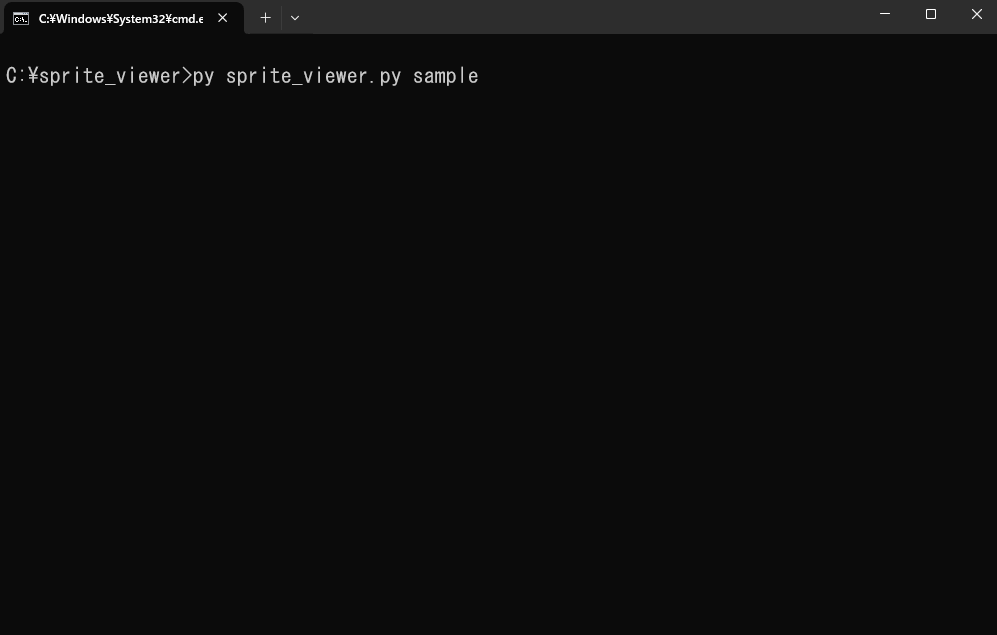
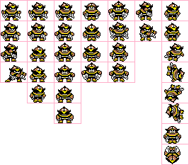

[ [English](https://github.com/y-tetsu/sprite_viewer/blob/main/README.md) | [日本語](https://github.com/y-tetsu/sprite_viewer/blob/main/README.jp.md)]<br>

# 🎮 Sprite Viewer

A simple Pygame-based tool for previewing 2D sprite animations from a spritesheet and JSON metadata.  
Great for checking retro-style animations (like NES/Famicom) during development.



---

## 📦 Features

- Loads `.png` + `.json` spritesheet and metadata
- Supports frame flipping (H/V)
- FPS adjustment
- Loop toggle
- Pause/resume playback
- Frame-by-frame control
- Zoom in/out (scale)
- Minimal UI with helpful animation info
- Automatically resizes window to fit sprite
- Configurable via command line

---

## 🖼️ JSON Format Example

```json
{
  "frame_width": 16,
  "frame_height": 16,
  "animations": [
    {
      "name": "walk",
      "frames": [0, 1, 2, 3],
      "fps": 8,
      "loop": true
    },
    {
      "name": "jump",
      "frames": [4, 5, 6],
      "fps": 6,
      "loop": false
    }
  ]
}
```

---

## 🚀 How to Run
### 🔧 Requirements
- Python 3.x
- pygame library

Install pygame:
```bash
pip install pygame
```

### ▶️ Usage
```bash
python sprite_viewer.py [basename] [--scale N] [--bg #RRGGBB] [--size WxH] [--border N]
```

#### 📘 Arguments:
| Option     | Description                                                     | Default         |
| ---------- | --------------------------------------------------------------- | --------------- |
| `basename` | File name prefix (e.g., `sample` → `sample.png`, `sample.json`) | `"spritesheet"` |
| `--scale`  | Display scale (zoom)                                            | `6`             |
| `--bg`     | Background color (hex)                                          | `#323232`       |
| `--size`   | Window size (e.g., `800x600`)                                   | auto fit        |
| `--border` | Border between frames (in pixels)                               | `1`             |


### 🎮 Controls
```less
[Select]  0–9          : Switch animation
[Anim  ]  Left / Right : Switch animation (when playing)
[Frame ]  Left / Right : Step frame (when paused)
[Speed ]  Up / Down    : Change FPS
[Zoom  ]  + / -        : Change scale
[View  ]  H / V / L    : Flip horizontal / vertical / toggle loop
          SPACE        : Pause / resume
```

---

## 📌 Display Example
```yaml
Anim : walk
FPS  : 12
Loop : ON
Frame: 3 / 6
Flip : HV
Scale: 6
Pause: OFF
```

---

## 📂 Example Files
- sample.png — Your sprite sheet
- sample.json — The animation metadata

You can switch between animations using 0–9 or arrow keys.

---

## 📝 License
MIT License.  
Created to help test retro-style 2D sprite animations more efficiently.

---

Made with ❤️ using pygame

---